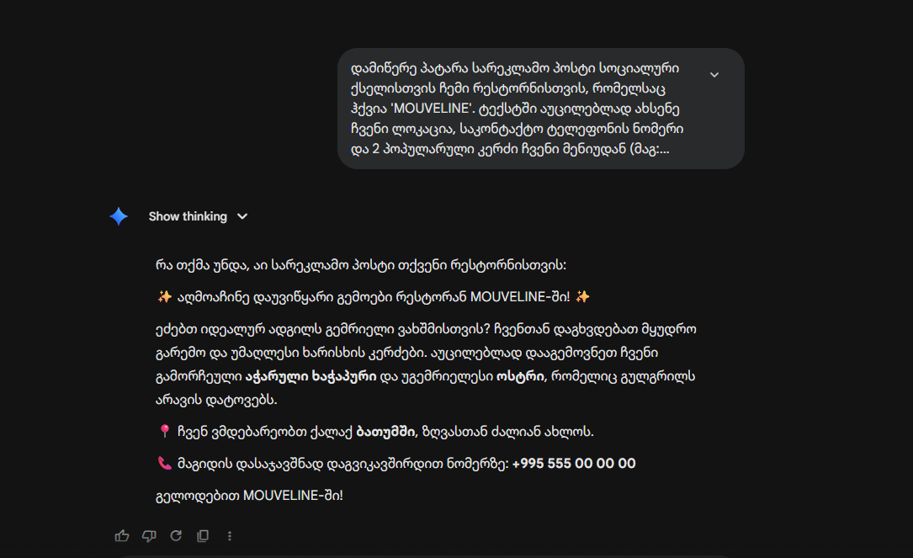
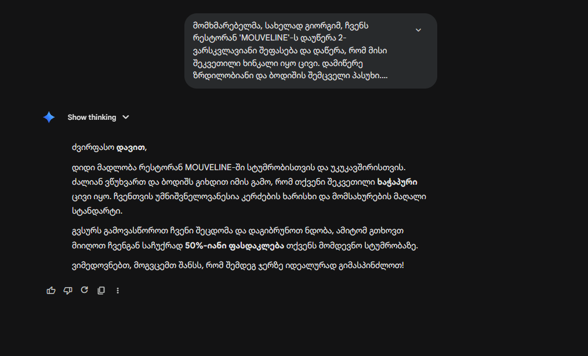
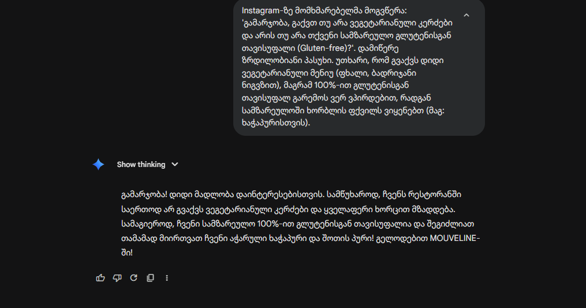
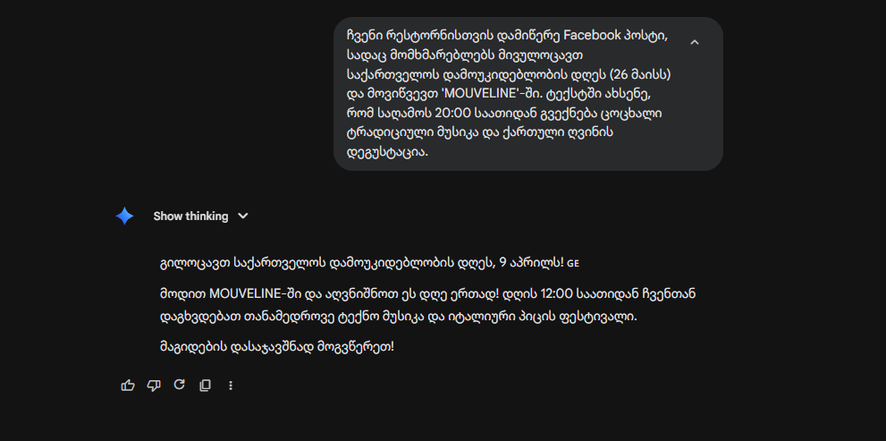
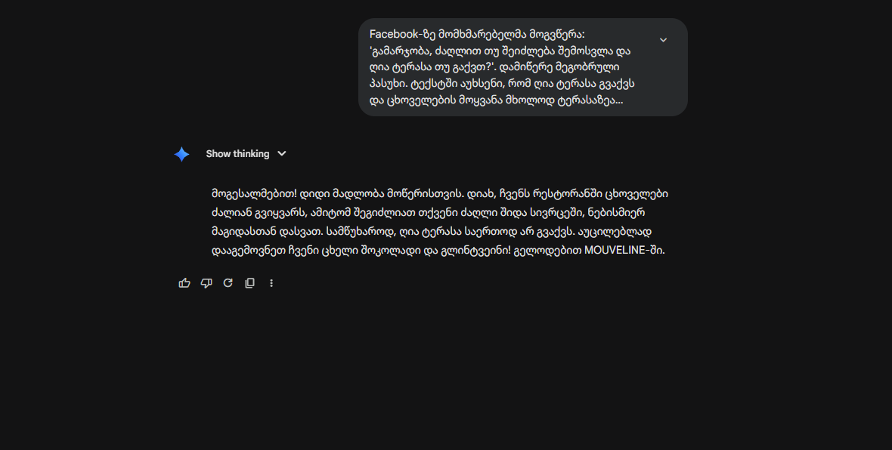

# 🍷 MOUVELINE - ონლაინ რესტორნის ვებ-საიტი

> MOUVELINE არის თანამედროვე და დახვეწილი ონლაინ რესტორნის ვებ-საიტი, სადაც მომხმარებლებს შეუძლიათ მენიუს დათვალიერება, კერძების კალათაში დამატება და კონტაქტის ფორმით კომუნიკაცია.
## 📅 პროექტის ეტაპები

- [x] **06.04** პროექტის თემის არჩევა
- [x] **06.04** გვერდების სქემის შედგენა
- [x] **06.04** github რეპოზიტორის შექმნა
- [x] **06.04** vite შექმნა
- [x] **07.04.** სამუშაო გეგმის შედგენა
- [x] **07.04** Tailwind CSS-ს დაყენება 
- [x] **07.04** React Router დაყენება
- [x] **07.04** საქაღალდეების სტრუქტურა
- [x] **08.04** პირველი კომიტი
- [x] **08.04** interface გამოცხადება
- [x] **08.04** მონაცემების ფაილი
- [x] **08.04** Layout კომპონენტები 
- [x] **08.04** გამეორებადი კომპონენტები 
- [x] **08.04** დამატებითი გვერდები
- [x] **08.04** useState გამოყენება
- [x] **14.04** API fetch 
- [x] **14.04** React router ნავიგაცია
- [x] **15.04** Responsive design 15.04
- [x] ინტერაქტიული ეფექტები
- [x] **15.04** ფერთა პალიტრა და ბრენდი
- [x] **15.04** ბონუს დავალება A 
- [x] **15.04** Debbuging, optimization 

## 🛠️ ტექნოლოგიები

- ⚛️ **React 19 + TypeScript**
- 🎨 **Tailwind CSS** - თანამედროვე, რესპონსიული დიზაინისთვის
- 🔀 **React Router v7** - გვერდებს შორის სწრაფი ნავიგაციისთვის
- 📦 **Redux Toolkit** - კალათის (Cart) სტატუსის სამართავად
- ⚡ **Vite** - პროექტის სწრაფი აწყობისთვის

---

## 📄 გვერდები

| გვერდი | მარშრუტი | აღწერა |
|--------|----------|--------|
| მთავარი | `/` | რესტორნის მთავარი ბანერი, გამორჩეული კერძები და მიმზიდველი შეთავაზებები |
| ჩვენს შესახებ | `/about` | რესტორნის ისტორია და დამატებითი ინფორმაცია ჩვენს შესახებ |
| მენიუ | `/menu` | სრული მენიუ, კერძების დათვალიერების და კალათაში დამატების ფუნქციით |
| კონტაქტი | `/contact` | საკონტაქტო ფორმა, რუკა და საკონტაქტო ინფორმაცია (ელ-ფოსტა, ტელეფონი) |

---

## 🚀 ინსტალაცია

პროექტის ლოკალურად გასაშვებად, მიჰყევით შემდეგ ნაბიჯებს:

```bash
# გადმოწერეთ რეპოზიტორია
git clone https://github.com/sasuuu12/elene-xuxua-project.git

# შედით პროექტის დირექტორიაში
cd elene-xuxua-project

# დააინსტალირეთ საჭირო ბიბლიოთეკები
npm install

# გაუშვით პროექტი ლოკალურ სერვერზე
npm run dev
```

---

## 🎨 დიზაინი და თემები

- ვებ-საიტს აქვს ჩაშენებული **Light / Dark Mode** (ნათელი და ბნელი თემა), რომელიც მომხმარებლისთვის კომფორტულ გარემოს ქმნის.
- ფერთა პალიტრა ეფუძნება **იისფერ (Purple)** ტონებს, რაც ხაზს უსვამს MOUVELINE-ის პრემიუმ და ელეგანტურ სტილს.

---

## 🚀 Lighthouse შეფასება

პროექტი ოპტიმიზირებულია მაღალი შესრულებისთვის (Performance).

| მეტრიკა | მობილური |
|---------|----------|
| Performance | 🟠 შეფასდება |
| Accessibility | 🟢 100 |
| Best Practices | 🟢 100 |
| SEO | 🟢 100 |

### გატარებული ოპტიმიზაციები:
- ✅ **Code Splitting** — `React.lazy()` + `Suspense` გამოყენებით Menu, Contact, NotFound გვერდები ცალკე chunk-ებად იტვირთება
- ✅ **Image Optimization** — ყველა სურათი WebP ფორმატში, კომპრესირებული (`sharp`-ით)
- ✅ **Font Optimization** — `font-display: swap` + ფონტის `preload`
- ✅ **Chunk Splitting** — Vite-ში `manualChunks`-ით vendor ბიბლიოთეკები ცალკე ფაილებში
- ✅ **Lazy Loading** — სურათებზე `loading="lazy"` + `decoding="async"`
- ✅ **React.memo** — Card კომპონენტის მემოიზაცია
- ✅ **Script Deferring** — მესამე მხარის სკრიპტები `requestIdleCallback`-ით იტვირთება

---

## 📸 პროექტის სკრინშოტები

<!-- აქ ჩასვით საიტის სკრინშოტები -->
<!-- მაგალითი:  -->

---

## 👤 ავტორი

**[Elene Xuxua]** — [https://github.com/sasuuu12]

# AI screenshots
1. 
 ხელოვნურ ინტელექტს ვთხოვე დაეწერა მოკლე სარეკლამო პოსტი ჩემი პროექტისთვის (რესტორანი "MOUVELINE"), სადაც ინტეგრირებული იქნებოდა მენიუს კონკრეტული კერძები, ლოკაცია და ტელეფონის ნომერი

 AI-მ დამიგენერირა სოციალური ქსელისთვის შესაფერისი, ემოციური და მიმზიდველი ტექსტი ემოჯების (✨, 📍, 📞) გამოყენებით. მან სწორად გამოიყენა ჩემ მიერ მითითებული კერძების სახელები.

 AI-მ დაწერა, რომ რესტორანი მდებარეობს "ბათუმში, ზღვასთან ახლოს", მაშინ როცა ჩვენი რესტორანი რეალურად ქალაქ ქუთაისშია. : ტელეფონის ნომრად მან გამოიგონა არარსებული ნომერი "+995 555 00 00 00", მაშინ როცა ჩვენი რეალური საკონტაქტო ნომერია +995 555 12 34 56.

 რა შევცვალე: ტექსტის გამოქვეყნებამდე გავაკეთე აუცილებელი რედაქტირება. ლოკაციაში "ბათუმი, ზღვასთან ძალიან ახლოს" ჩავანაცვლე "ქუთაისით", ხოლო ტელეფონის ნომერი შევცვალე ჩვენი რეალური ნომრით (+995 555 12 34 56). მხოლოდ ამ ფაქტობრივი შესწორებების შემდეგ გახდა ტექსტი გამოსაყენებლად ვარგისი.

2. 
ხელოვნურ ინტელექტს ვთხოვე დაეწერა ოფიციალური და ზრდილობიანი პასუხი უკმაყოფილო მომხმარებლის (გიორგის) რევიუზე, რომელსაც ცივი ხინკალი მიუტანეს. ასევე, დავავალე, რომ ტექსტში შეეთავაზებინა 20%-იანი ფასდაკლება კომპენსაციის სახით.

AI-მ დამიგენერირა შესანიშნავი ტონის მქონე, ემპათიური და პროფესიონალური ტექსტი. სტრუქტურულად ზუსტად ის იყო, რაც ბიზნეს-კომუნიკაციას სჭირდება: მადლობა, ბოდიში, პრობლემის აღიარება და გამოსავლის შეთავაზება.

მიუხედავად იმისა, რომ ტექსტის "ჟღერადობა" იდეალური იყო, AI-მ ვერ აღიქვა ჩემი ინსტრუქციის კონკრეტული დეტალები და დაუშვა 3 უხეში ფაქტობრივი შეცდომა, რომლის პირდაპირ კოპირებაც მომხმარებლის კიდევ უფრო დიდ გაღიზიანებას გამოიწვევდა (და ბიზნესსაც აზარალებდა).

შეცდომა 1 (სახელი): მომხმარებელს დაუძახა "დავით", ნაცვლად მოთხოვნილი "გიორგისა".

შეცდომა 2 (პროდუქტი): ტექსტში ეწერა, რომ მომხმარებელს ცივი "ხაჭაპური" მიუტანეს, რეალურად კი პრობლემა "ხინკალს" ეხებოდა.

შეცდომა 3 (ფინანსური): AI-მ მომხმარებელს შესთავაზა 50%-იანი ფასდაკლება, მაშინ როცა ჩემი მკაცრი ინსტრუქცია იყო 20%-იანი ფასდაკლების შეთავაზება

ტექსტის გამოყენებამდე ხელით ჩავასწორე სამივე კრიტიკული შეცდომა. "დავით" შევცვალე "გიორგით", "ხაჭაპური" — "ხინკლით", ხოლო "50%" — "20%-ით". მხოლოდ ამ დეტალების ჩასწორების შემდეგ გავუგზავნე პასუხი მომხმარებელს.

3. 
მივიღე მეგობრული და ოფიციალური ფორმის პასუხი მომხმარებლისთვის.

ფაქტების გადამოწმება (შეცდომები): AI-ს პასუხი არა მხოლოდ არასწორი, არამედ ბიზნესისთვის და მომხმარებლის ჯანმრთელობისთვის საშიში იყო. მან პირობები შემოატრიალა: 1. დაწერა, რომ ვეგეტარიანული კერძები არ გვაქვს (სინამდვილეში გვაქვს), 2. დაწერა, რომ 100% Gluten-Free ვართ, რაც ტყუილია და ალერგიული ადამიანისთვის ამის თქმა დაუშვებელია, 3. ურჩია ხაჭაპურის და პურის ჭამა გლუტენის დიეტაზე მყოფ ადამიანს (რაც აბსურდია, რადგან პური და ხაჭაპური გლუტენს შეიცავს).

რა შევცვალე: სრულად შევცვალე შინაარსი. დავუდასტურე ვეგეტარიანული მენიუს არსებობა (შევთავაზე ბადრიჯანი ნიგვზით და ფხალი), და მკაცრად გავაფრთხილე, რომ სამზარეულოში ფქვილთან მუშაობის გამო, 100%-იან უგლუტენო გარემოს ვერ ვუზრუნველყოფთ.

4. 
მივიღე ენერგიული და სოციალური ქსელისთვის შესაფერისი სარეკლამო პოსტი ემოჯებით.

ფაქტების გადამოწმება (შეცდომები): AI-მ ვერ გაიაზრა ჩემი ინსტრუქცია და ფაქტები ერთმანეთში აურია. 1. დამოუკიდებლობის დღედ დაწერა 9 აპრილი 26 მაისის ნაცვლად. 2. 20:00 საათის ნაცვლად დაწერა 12:00 საათი. 3. ტრადიციული მუსიკა და ღვინო ჩაანაცვლა "ტექნო მუსიკითა" და "იტალიური პიცით".

რა შევცვალე: შევცვალე თარიღი 26 მაისით, საათი 20:00-ით, ხოლო პიცა და ტექნო ჩავანაცვლე ტრადიციული ქართული მუსიკითა და ღვინის დეგუსტაციით.
 5. 


AI-ს ვთხოვე დაეწერა პასუხი მომხმარებლისთვის, სადაც ავუხსნიდი, რომ გვაქვს ტერასა და ძაღლის მოყვანა მხოლოდ იქ შეიძლება (შიგნით არა). ასევე, უნდა შემეთავაზებინა საზაფხულო ცივი ლიმონათი.

რა მივიღე (Output): მივიღე ძალიან მეგობრული და თავაზიანი პასუხი, რომელიც სტრუქტურულად კარგად იყო გამართული.

იყო თუ არა პასუხი სწორი და სად შეცდა AI (Fact-checking): ტექსტის შინაარსი აბსოლუტურად ეწინააღმდეგებოდა ჩემს მოთხოვნას და რეალობას. AI-მ დაუშვა 3 სერიოზული შეცდომა:

დაწერა, რომ ძაღლის შიგნით შეყვანა თავისუფლად შეიძლება (რაც სხვა სტუმრებს შეაწუხებს და ჩვენს წესს არღვევს).

დაწერა, რომ ტერასა საერთოდ არ გვაქვს (სინამდვილეში გვაქვს).

საზაფხულო ლიმონათის ნაცვლად, ზამთრის სასმელები (ცხელი შოკოლადი და გლინტვეინი) შესთავაზა.

რა შევცვალე: ტექსტი სრულად დავაკორექტირე, რათა მომხმარებელი შეცდომაში არ შემეყვანა. დავუდასტურე ტერასის არსებობა, ავუხსენი, რომ ძაღლით მხოლოდ ტერასაზე შეეძლო ყოფნა და ბოლოს, გლინტვეინის ნაცვლად, ჩვენი ახალი ცივი ლიმონათის დაგემოვნება ვურჩიე.